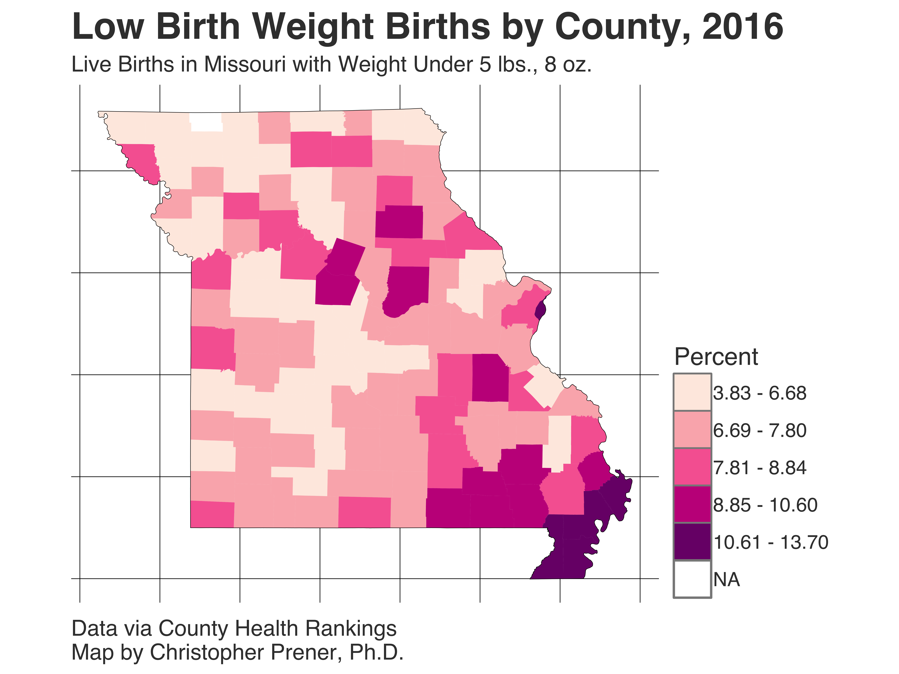

# MO_HEALTH_lowBirthWeight

### Abstract
This repository contains a map image of counties in Missouri, colored by their 2016 estimated low birth weight births as a percentage of the total number of live births. These data were obtained from the County Health Ranks 2016 data release for Missouri. I use this map for teaching about low birth weight (part of the gender section of the course).

### Preview

### Resources
* [County Health Rankings](http://www.countyhealthrankings.org)
* [Acevedo-Garcia et al 2005](http://pediatrics.aappublications.org/content/115/1/e20.short)
* [Collins et al 2004](https://ajph.aphapublications.org/doi/abs/10.2105/AJPH.94.12.2132)
* [David and Collins 1997](http://www.nejm.org/doi/full/10.1056/NEJM199710233371706)
* [Osypuk and Acevedo-Garcia 2007](https://academic.oup.com/aje/article/167/11/1295/131712)

### Citing These Images
This repository is associated with a [Digital Object Identifier](https://en.wikipedia.org/wiki/Digital_object_identifier) (or DOI). Please include the DOI when citing these images. You can find pre-formatted citations and a BibTeX entry, among other citation resources, on the associated [Zenodo release page](https://zenodo.org/record/1226412).

## About SOC 1120: Introduction to Sociology - Diversity and Health Emphasis
### Course Description
This course is a specialized section of Introduction to Sociology offered at [Saint Louis University](http://wwww.slu.edu). It uses health examples to highlight course topics throughout the semester, continually emphasizing the ways in which inequality and the social determinants of health shape American life.

### About Christopher Prener, Ph.D.
Chris is an urban and medical sociologist with an interest in mixed methods research designs that incorporate spatial data. His dissertation examined the effect of neighborhood context and conditions on emergency medical services work, particularly with patients who have mental illnesses or substance use disorders. He is also part of a research team examining the effects of literacy on mental health service use and recovery, and his student research team is documenting the effects of systemic street closures in St. Louis. He is an Assistant Professor in the Department of Sociology and Anthropology at Saint Louis University. More details are available at [his website](https://chris-prener.github.io) and he can be contacted at [chris.prener@slu.edu](mailto:chris.prener@slu.edu).

### About Saint Louis University 
Founded in 1818, [Saint Louis University](http://wwww.slu.edu) is one of the nation’s oldest and most prestigious Catholic institutions. Rooted in Jesuit values and its pioneering history as the first university west of the Mississippi River, SLU offers nearly 13,000 students a rigorous, transformative education of the whole person. At the core of the University’s diverse community of scholars is SLU’s service-focused mission, which challenges and prepares students to make the world a better, more just place.
